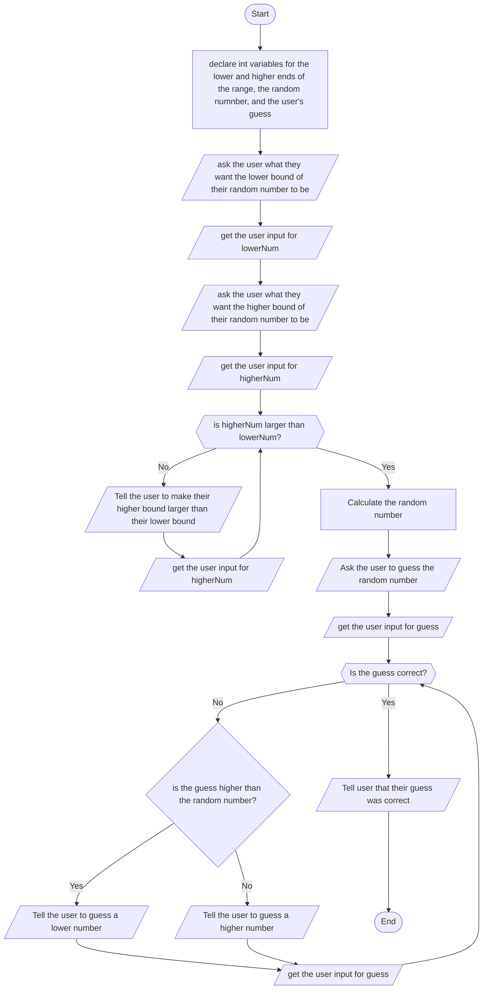

# Flowchart

# Description
First, the prgram asks for the user's lower and higher bounds for the random number that they will guess. If the higher bound is not larger than the lower bound, the program will ask the user to re-enter it. A random number in that range is then generated and stored. Next, the program asks the user to guess the random number. The user's guess is stored in a variable named guess and is compared to the random number. If the guess is too high, the program tells the user to guess lower, and if the guess is too low, the program tells the user to guess higher. If the guess is equal to the random number, the user wins.
