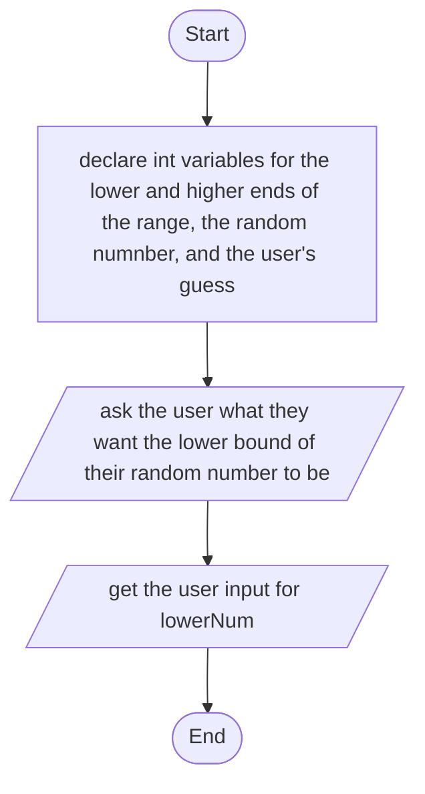

```mermaid
flowchart TD
Start([Start]) --> declare[declare int variables for the lower and higher ends of the range, the random numnber, and the user's guess] --> lowerQ[/ask the user what they want the lower bound of their random number to be/] --> lowerInp[/get the user input for lowerNum/] --> End([End])
```
